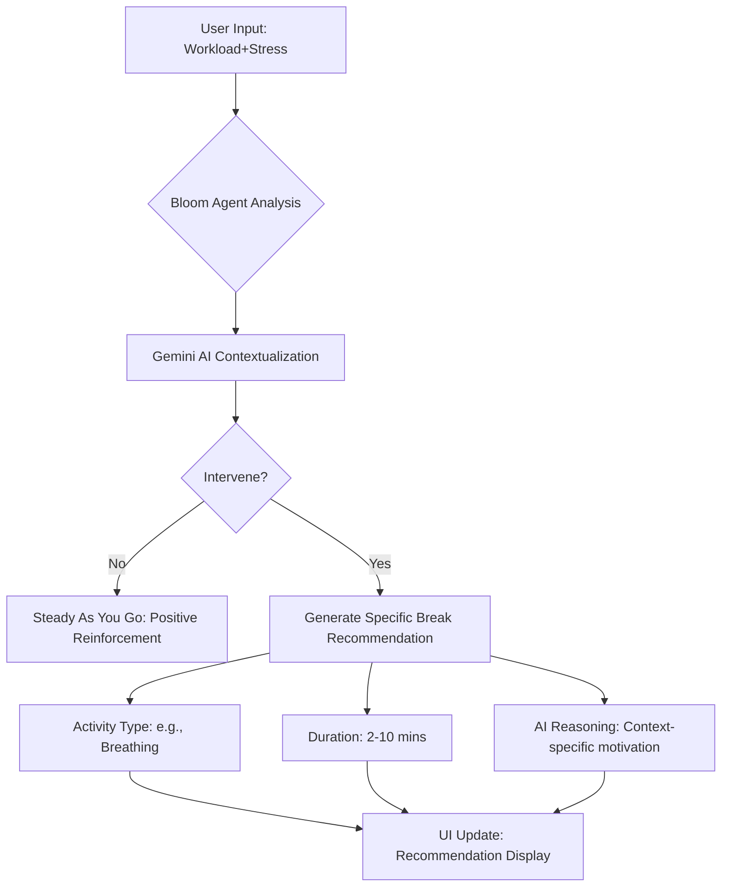

# 🌸 Workday Wellness Agent

Workday Wellness Agent (Bloom) is a sophisticated wellness companion designed for the modern professional. It analyzes calendar-derived workload signals and subjective stress levels to determine the optimal moment for a high-impact, short wellness break.


## ✨ Features

- **Intelligent Workload Analysis**: Processes meeting density, continuous blocks, and time since last break.
- **Stress-Aware Intervention**: Uses self-reported stress levels to calibrate the urgency of breaks.
- **Gemini-Powered Reasoning**: Leverages the `gemini-3-flash-preview` model for context-aware, conservative, and medically safe wellness suggestions.
- **Proactive Burnout Prevention**: Specifically designed to intervene *before* burnout peaks.

## 🧠 The Wellness Logic

Bloom follows a strict set of heuristics to ensure interventions are helpful, not distracting:

1.  **Conservative Interruption**: Bloom values your deep work and only suggests breaks when workload signals indicate a high risk of fatigue.
2.  **Short & Impactful**: Break durations are kept between **2 to 10 minutes** to fit seamlessly into a busy schedule.
3.  **Low-Activity Grace**: If meeting density and stress levels are both "Low", Bloom will not intervene.
4.  **No Medical Claims**: Advice is focused purely on wellness (stretching, breathing, hydration) and never makes medical diagnoses or prescriptions.

## 📊 System Flow Diagram



## 🏗️ Architecture

- **Frontend**: React 19 + Tailwind CSS
- **Intelligence**: Google Gemini API (`@google/genai`)
- **Icons**: Font Awesome 6
- **State Management**: React Hooks (useState)

## 🚀 Technical Implementation

Bloom utilizes the Gemini Flash model to process a real-time data object:

```typescript
export interface WorkloadData {
  meetingDensity: 'Low' | 'Medium' | 'High';
  longestBlockMinutes: number;
  timeSinceLastBreakMinutes: number;
  remainingMeetings: number;
  stressLevel: number; // 1-10 scale
  timeOfDay: string;
}
```

The model returns a structured JSON response to drive the UI state:

```json
{
  "intervene": true,
  "break_type": "Deep Breathing",
  "duration_minutes": 5,
  "reasoning": "You've been in meetings for 120 minutes straight. A quick reset will help your focus for the next block."
}
```
Here is your text converted into **clean Markdown** format:

---

## 📈 Opik Integration (Evaluation & Observability)

This project uses **Opik** to track agent performance, monitor behavior, and continuously improve decision quality. Opik captures both the inputs (calendar signals and stress levels) and outputs (agent decisions) for each run, enabling systematic evaluation and comparison across prompt versions.

### What Opik Tracks

Each agent run logs:

* Meeting density
* Longest continuous meeting block
* Time since last break
* Remaining meetings
* Stress level
* Time of day
* Agent decision output (intervene, break type, duration, reasoning)
* Prompt version and model configuration

### Evaluation Metrics

Opik evaluates the agent using custom metrics such as:

* **Intervention appropriateness**
  (Was the decision aligned with high workload and high stress?)
* **Break duration alignment**
  (Was the break duration reasonable given the meeting density?)
* **False positive rate**
  (How often does the agent interrupt during low workload?)
* **Reasoning quality**
  (Does the reasoning mention calendar signals and stress level clearly?)

### How Opik Improves the Agent

Opik allows the team to:

* Compare prompt versions and identify the best-performing one
* Detect regression when a new prompt makes the agent too aggressive or too passive
* Tune the agent to minimize unnecessary interruptions while maximizing wellness impact


## 🎨 Branding & Aesthetics

The interface is built with the **Bloom Design System**, featuring:
- **Primary Pink (`#F472B6`)**: Energetic and empathetic.
- **Accent Yellow (`#FBBF24`)**: Warmth and focus.
- **Soft Blue (`#60A5FA`)**: Calmness and stability.
- **Inter Font Family**: For maximum readability.

---
*Stay mindful, stay productive.*